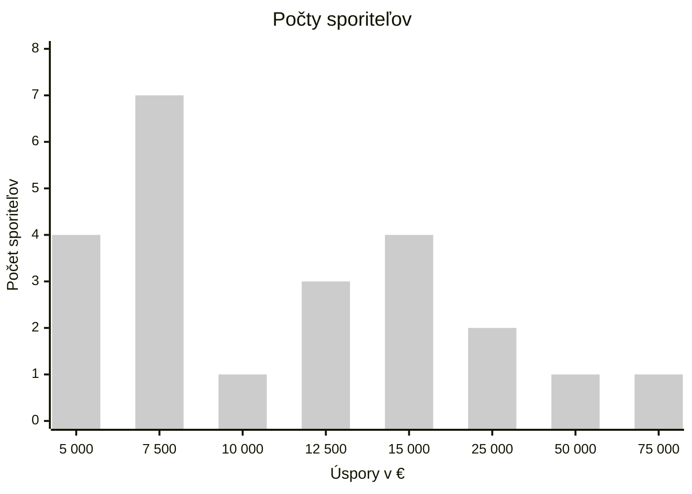

# Databáza maturitných zadaní: Matematika 2026

---

## Maturitné zadanie 01

**1.** Definujte kvadratickú funkciu.

Popíšte, na akej množine môže byť definovaná a ktoré z nasledujúcich vlastností môže kvadratická funkcia spĺňať: je prostá, monotónna, má maximum, alebo minimum, je ohraničená, párna alebo nepárna?

**2.** Dokážte, že spojnice bodov, ktoré vyznačujú na ciferníku hodiniek čísla 11,3 a 2,6 sú na seba kolmé.

**3.** Je daná postupnosť $$\left\{\frac{\operatorname{n}}{n+3}\right\}_{n=1}^\infty$$

* zistite či je daná postupnosť ohraničená
* vyjadrite túto postupnosť rekurentne. Existuje aj iné rekurentné určenie danej postupnosti?

## Maturitné zadanie 02

**1.** Definujte základné pojmy štatistiky: štatistický súbor, štatistický znak, absolútna a relatívna početnosť, modus, medián, rozptyl a diagram. Vysvetlite na príkladoch.

* Konkrétna pomôcka: Diagramy

**2.** Využitím vlastností súhlasných, striedavých alebo vrcholových uhlov dokážte, že:

* súčet veľkostí vnútorných uhlov trojuholníka je 180°
* trojuholník MBC je rovnoramenný, pričom bod M je priesečník priamky AB a rovnobežky s osou uhla β vedenej vrcholom C v ľubovolnom trojuholníku ABC

**3.** Daná je funkcia $$f:y={-x}^2+4x-3$$
* načrtnite grafy funkcií $f(x),|f(x)|$
* určte pre všetky $r\in R$ , pre ktoré má rovnica $|f(x)| = r$ práve 4 riešenia
* ako je potrebné zmeniť číslo -3 v predpise funkcie $f$, aby graf funkcie prechádzal bodom $[0;2]$

## Maturitné zadanie 03

**1.** Definujte pojem pravdepodobnosti náhodného javu, uveďte základné vlastnosti. Objasnite pojmy doplnková pravdepodobnosť a nezávislé javy. Ilustrujte na jednoduchých príkladoch (napr. hod kockou).

**2.** Dokážte Euklidovu vetu o odvesne

**3.** Určte definičný obor nasledujúcich funkcií:
* $f:y=\sqrt{\frac{(2-x)(x+3)}{4x}}$
* $g:y=\frac{1}{\cos x}$
* $h:y=\sqrt{\log x}$

 uveďte ako sa zmení $D(h)$, ak predpis funkcie $h$ upravíme naslednovne:
* $h:y=\log \sqrt{x}$

## Maturitné zadanie 04

**1.** Definujte pojmy variácie s opakovaním a bez opakovania, permutácie, faktoriál. Vysvetlite použitie kombinatorického pravidla súčtu a súčinu.

**2.** Odvoďte vzorec $S=\frac{a.b.\sin γ}{2}$ na výpočet obsahu ľubovoľného trojuholníka.

**3.** Ak pripočítam k číslam $-6, 2, 26$ to isté číslo $k$, dostanem prvé tri členy geometrickej postupnosti.

Určte toto číslo $k$, prvý člen získanej postupnosti a jej kvocient.

Aké číslo $k$ musím pripočítať k daným číslam, ak chcem získať aritmetickú postupnosť?

## Maturitné zadanie 05

**1.** Definujte kombinácie - vysvetlite na konkrétnom príklade. Definujte kombinačné číslo a jeho vlastnosti. Pascalov trojuholník.

**2.** Dokážte, že v ľubovoľnom trojuholníku ťažisko rozdeľuje ťažnicu v pomere $2:1$.

**3.** Vypočítajte prieniky s osami a načrtnite graf funkcie 
$$f:y=(\frac{1}{3})^{x-2}-1$$
Určte všetky $r\in R$, pre ktoré má rovnica $|f(x)|=r$ práve 2 riešenia. Ako je potrebné zmeniť číslo -1 v predpise funkcie, aby graf funkcie f nepretínal x-ovú os?

## Maturitné zadanie 06

**1.** Analyticky vyjadrite priamku v rovine (aspoň 2 rôznymi spôsobmi) a klasifikujte vzájomnú polohu dvoch priamok v rovine.

**2.** Zostrojte všetky trojuholníky ABC, v ktorých $|AB|:|AC|=3:4$  $t_{a}=6cm$ a $α=50°$

**3.** Načrtnite graf funkcie $$f:y=|\log_\frac{1}{2} (x) -5|$$
Potom graficky určte všetky $x\in D(f)$, pre ktoré $f(x)\in (1;5\rangle$

Zmeňte predpis funkcie $f$ tak, aby graf funkcie mal spolocčný bod s osou y.

## Maturitné zadanie 07

**1.** Definujte a nakreslite množiny bodov s danou vlastnosťou:
- os úsečky
- os uhla
- os pásu
- množina $G_α$​
- Talesova kružnica
- ekvidištanta priamky
- ekvidištanta kružnice

**2.** Dokážte, že rozdiel druhých mocnín dvoch ľubovoľných po sebe idúcich nepárnych prirodzených čísel je deliteľný 8.

**3.** Dané sú body $A[6,5]$, $B[4,1]$ a $C[6,0]$. Overte (nie graficky), že body $A,B,C$ tvoria vrcholy trojuholníka. 

Vypočítajte veľkosť ťažnice na stranu a. 

Ako by sa mali zmeniť súradnice bodu $C$, aby dané body ležali na jednej priamke?

## Maturitné zadanie 08

**1.** Definujte lineárnu funkciu. Popíšte, na akej množine môže byť definovaná a ktoré z nasledujúcich vlastností môže lineárna funkcia spĺňať: je prostá, párna, monotónna, má maximum, alebo minimum, je ohraničená? 

Daná je funkcia: $$f:y=-2x+3;x\in (-7;3\rangle$$
Určte $D(f),H(f)$ a popíšte, ktoré z hore uvedených vlastností funkcia $f$ spĺňa.

**2.** Dokážte, že trojciferné číslo „$xyz$“, kde $x,y,z$ sú jeho cifry, je deliteľné tromi práve vtedy, keď súčet $x+y+z$ je deliteľný tromi. Návod: použite desiatkový rozklad čísla $xyz$.

**3.** Vypočítajte obsah trojuholníka $ABC$ a veľkosť uhla $β$, ak $A[3,2]$, $B[-1,1]$ a $C[11,-6]$

Ako treba zmeniť y-ovú súradnicu bodu $C$, aby trojuholník $ABC$ bol pravouhlý s pravým uhlom pri vrchole $B$?

## Maturitné zadanie 09

**1.** Objasnite pojem funkcia. Vysvetlite pojmy definičný obor a obor hodnôt funkcie. Popíšte vlastnosti funkcií, ktoré poznáte. Ilustrujte na konkrétnom príklade.

_Konkrétna pomôcka: Obrázky rôznych grafov_

**2.** Dokážte, že bodom M, ktorý leží mimo priamky $p$, je možné viesť najviac jednu rôznobežku kolmo na priamku $p$.

**3.** Určte stred a polomer kružnice $k:x^2+y^2−3x+2y−3=0$ a jej vzájomnú polohu s priamkou $p:2x−y=0$. 

Zmeňte číslo $-3$ v predpise kružnice tak, aby nebol vyjadrením kružnice.

Ako sa zmení ich vzájomná poloha, ak bude mať priamka rovnicu $x-y-9=0$?

## Maturitné zadanie 10

**1.** Klasifikujte hranaté a rotačné telesá. Ich vlastnosti opíšte na konkrétnych príkladoch (napríklad pravidelný 6-boký hranol, ihlan a rotačný valec).

_Konkrétne pomôcky: modely rôznych telies._

**2.** Využitím definície kružnice odvoďte analytické vyjadrenie kružnice so stredom v bode S:

- a) $S[0,0]$
- b) $S[m,n]$

**3.** Riešte v R nerovnicu: $$\frac{x^2+3x-18}{(1-x).2^x}\ge0$$
Ako sa zmení riešenie nerovnice, ak znak nerovnosti zmeníme na "menší ako nula"?

## Maturitné zadanie 11

**1.** Objasnite pojmy vektor, umiestnenie vektora, súradnice vektora a jeho veľkosť, opačný vektor k danému, súčet a rozdiel dvoch vektorov, násobok vektora reálnym číslom.

**2.** Odvoďte vzorec pre výpočet obsahu
- a) rovnostranného trojuholníka s danou výškou $v$
- b) kosoštvorca s uhlopriečkami $e,f$

**3.** Napíšte predpis lineárnej funkcie f s $D(f)\subset R$, ktorá prechádza bodom so súradnicami $[3;−7]$ a nadobúda maximum v bode $x=-5$, ktorého hodnota je $y=9$. Minimum $f$ nenadobúda. 

Načrtnite grafy funkcií $f(x),|f(x)|$. Napíšte predpis funkcie $g$, ktorej $D(g)=D(f)$ a ktorej graf je rovnobežný s funkciou $f$ a prechádza začiatkom súradnicovej sústavy.

## Maturitné zadanie 12

**1.** Klasifikujte vzájomnú polohu dvoch priamok, dvoch rovín a priamky a roviny v priestore, podľa počtu spoločných bodov.

**2.** Do vnútra štvorca $ABCD$ so stranou dlhou $6 cm$ umiestnite bod $P$ tak, že $|AP|=3cm$ a $|BP|=4cm$. Zostrojte rovnostranný trojuholník $PQR$ tak, aby vrcholy $Q,R$ ležali na obvode štvorca $ABCD$.

**3.** Využitím grafu inverznej funkcie načrtnite graf funkcie 
$$f:y=2+\sqrt{x-8}$$
Ako je potrebné zmeniť číslo $2$ v predpise funkcie $f$, aby graf funkcie prechádzal bodom A so súradnicami $[0;0]$?

## Maturitné zadanie 13

**1.** Definujte mocninovú funkciu. Klasifikujte typy mocninových funkcií podľa mocniteľa – ilustrujte na grafoch.

Daná je funkcia $f:y=x^{10}$$.

Určte $D(f),H(f)$ a popíšte, ktoré z nasledujúcich vlastností funkcia $f$ spĺňa: je prostá, monotónna, nadobúda maximum alebo minimum, je ohraničená, či párna?

**2.** Dokážte že $$\forall{n}\in N:15\;|\;(3n3-12n).(n2-1)$$
**3.** Pozorovateľ na brehu mora vidí dva člny pod zorným uhlom 120°. Člny sú od pozorovateľa vzdialené 2 a 3 míle.

Koľko si nadíde lodivod prvého člnu, ak sa k druhému nepriplaví priamo, ale cestou sa zastaví pri pozorovateľovi?

Aký uhol zviera kratšia trajektória k pozorovateľovi s trajektóriou k druhému člnu?

## Maturitné zadanie 14

**1.** Definujte exponenciálnu funkciu. Povedzte na akej množine je definovaná a aké hodnoty nadobúda. Opíšte graf a uveďte, ktoré z uvedených vlastností, môže exponenciálna funkcia spĺňať: je prostá, monotónna, má maximum, alebo minimum, je ohraničená párna alebo nepárna.

**2.** Vo firme Holmes vyvinuli nový typ trezoru T6, ktorý sa otvára zatlačením 6 tlačidiel, pričom na poradí ich stláčania nezáleží. Na trezore je 10 tlačidiel. Obchodníci ho začali predávať ako bezpečnejší model, za takmer dvojnásobnú cenu oproti trezoru T4, ktorý sa otváral stlačením len 4 tlačidiel. Napriek tomu skoro všetci zákazníci kupovali model T4, hoci na bezpečnosti im záležalo viac ako na cene. Prečo?

V tej istej firme začali ponúkať aj lacnejší model K3, ktorý bol mechanický a otváral sa nastavením správnej cifry na každom z troch kotúčov s 10 ciframi (klasický kufríkový zámok). Odvtedy už nepredali ani jeden kus z modelov radu T. Prečo?

**3.** Dané sú body $A[2,1]$ a $B[3,7]$. Napíšte parametrické vyjadrenie priamky $AB$ aj jej rovnicu v smernicovom tvare.

Ako treba zmeniť súradnice bodu $A$, aby:
- a) priamka bola rovnobežná s osou $x$
- b) priamka prechádzala začiatkom súradnicovej sústavy
- c) priamka mala smerový uhol $45°$?

## Maturitné zadanie 15

**1.** Definujte logaritmickú funkciu. Povedzte na akej množine je definovaná a aké hodnoty nadobúda. Popíšte graf a uveďte, ktoré z uvedených vlastností, môže logaritmická funkcia spĺňať: je prostá, monotónna, má maximum, alebo minimum, je ohraničená, párna, alebo nepárna. 

Určte inverznú funkciu k funkcii $f:y=(\frac{1}{2})^x$ a načrtnite jej graf.

**2.** Dané sú tri priamky $k$,$l$,$m$, pričom priamky $k$ a $m$ sú rovnobežné, priamka $l$ je s nimi rôznobežná. Zostrojte všetky *rovnostranné trojuholníky* $ABC$, v ktorých ťažnica $t_c$​ je časťou priamky $m$, a vrcholy $A$,$B$ ležia postupne na priamkach $k$,$l$.

**3.** Osovým rezom valca je obdĺžnik s uhlopriečkou dĺžky $20 cm$. Výška valca je *2-krát väčšia* než *priemer podstavy*. Vypočítajte objem valca v **litroch**. 

*Ako sa zmení* objem valca, ak sa daná uhlopriečka **zdvojnásobí**?

## Maturitné zadanie 16

**1.** Využitím jednotkovej kružnice definujte funkcie kosínus a tangens. Načrtnite ich grafy, určte na akých množinách sú tieto funkcie definované a popíšte, ktoré z nasledujúcich vlastností každá funkcia spĺňa: či je prostá, monotónna, má maximum, alebo minimum, je ohraničená párna alebo nepárna.

**2.** Dokážte Pytagorovu vetu.

**3.** V obchodnom dome majú zo 100 televízorov 85 bezchybných a 15 televízorov so skrytou vadou. Ak prvých desať kupujúcich dostalo bezchybný televízor, aká je pravdepodobnosť, že jedenástemu predajú televízor so skrytou vadou? Ako by sa zmenila situácia, keby prvých 10 kupujúcich dostalo chybný televízor?

## Maturitné zadanie 17

**1.** Objasnite pojem postupnosť, graf postupnosti. Povedzte, ktoré vlastnosti postupností určujeme. Ilustrujte na príklade. Definujte pojmy aritmetická a geometrická postupnosť.

**2.** Dokážte sínusovú vetu.

**3.** Zostrojte graf funkcie $$f: y = |(x + 2)^2 - 1|$$
Ako sa zmenia extrémy funkcie $f$, ak z predpisu funkcie odstránime absolútnu hodnotu?

## Maturitné zadanie 18

**1.** Vysvetlite pojem množina. Na konkrétnych množinách popíšte základné množinové operácie - zjednotenie, prienik, doplnok a rozdiel množín. Vysvetlite pojem interval.

**2.** Dokážte, že v ľubovoľnom trojuholníku $KLM$ majú body $K$ a $L$ rovnakú vzdialenosť od priamky, na ktorej leží ťažnica na stranu $m$.

**3.** Graf udáva počet sporiteľov podľa výšky úspor. 

Určte priemernú výšku úspor, modus a medián. Ako by sa zmenili tieto charakteristiky, ak by do skupiny sporiteľov nepatrili dvaja s najväčšou výškou úspor? Koľko percent sporiteľov má nadpriemerné úspory?

## Maturitné zadanie 19

**1.** Objasnite pojmy: spoločný deliteľ, spoločný násobok, najväčší spoločný deliteľ, najmenší spoločný násobok, prvočíslo, zložené číslo. 

Popíšte spôsoby ich vyhľadávania, ukážte na dvojici $(423, 900)$.

**2.** Rozhodnite o monotónnosti funkcií $$f: y = -3x + 7$$ $$g: y = x^2 - 0,81$$Svoje tvrdenia dokážte.

**3.** Určte veľkosti strán a obsah trojuholníka ABC, ak pre jeho uhly platí $\alpha : \beta : \gamma = 2 : 1 : 3$ a strana $b = 10 cm$. Ako treba zmeniť stranu $b$, aby obsah trojuholníka $ABC$ bol $200 cm^2$?

## Maturitné zadanie 20

**1.** Definujte kruh a kružnicu. Pomenujte a nakreslite vzájomné polohy:

* priamky a kružnice
* dvoch kružníc

a vysvetlite všetky pojmy súvisiace s týmito polohami.  Definujte kruhový výsek a odsek.

**2.** Rozhodnite o parite funkcií:
$$f:y=\frac{4x}{x^2-4}$$
$$g:y=(\cos x)-1$$
Svoje tvrdenia odôvodnite.

**3.** Daná je kocka $ABCDEFGH$ s telesovou uhlopriečkou dĺžky $2\sqrt{3}$ Bod $X$ je stredom hrany $EF$, bod $Y$ je stredom hrany $GH$.

1. Aký je objem telesa $XYGFC$?
2. Aký je objem telesa $XYGFA$?
3. Aký je objem telesa $XYGFBC$?

## Maturitné zadanie 21
**1.** Definujte pojem štvoruholník a vysvetlite pojmy: vrchol, strana, vnútorný uhol a uhlopriečka štvoruholníka, konvexný a nekonvexný štvoruholník. Rozdeľte štvoruholníky podľa veľkosti a rovnobežnosti strán a podľa veľkosti vnútorných uhlov. Opíšte charakteristické vlastnosti vybraného štvoruholníka.

**2.** Dokážte platnosť uvedených vzťahov:
1. $\sin^2 x + \cos^2 x = 1$
2. $\text{tg } x \cdot \text{cotg } x = 1$
3. $\forall a, r, s \in \mathbb{N}: a^{r+s} = a^r \cdot a^s$.

**3.** Logická funkcia (NOR) je pravdivá vtedy a len vtedy, keď sú súčasne nepravdivé oba výroky A aj B. Napíšte tabuľku pravdivostných hodnôt výrokovej formuly: $(A \vee B) \vee (A \downarrow B)$. Zmeňte výrokovú formulu tak, aby bola vždy nepravdivá. Overte.

## Maturitné zadanie 22
**1.** Vysvetlite pojmy rovnoľahlosť, stred rovnoľahlosti, koeficient rovnoľahlosti. Opíšte postup zobrazovania úsečky v podobnom zobrazení - uvažujte o rôznych hodnotách koeficientu rovnoľahlosti.

**2.** Dokážte, že postupnosť je aritmetická
$$\left\{\frac{3-\operatorname{n}}{5}\right\}_{n=1}^\infty$$

O tejto postupnosti dokážte, že je geometrická
$$\left\{\frac{4^{n+2}}{3^{n+1}}\right\}_{n=1}^\infty$$

**3.** V rovnoramennom *lichobežníku* $ABCD$ so základňou $AB$ poznáme dĺžku ramien $b=5cm$ a veľkosť uhlopriečok $e=7cm$. Veľkosť uhla $|\angle ADC|=120\degree$

Vypočítajte obsah lichobežníka $ABCD$.
## Maturitné zadanie 23

**1.** Vymenujte ekvivalentné úpravy používané pri riešení rovníc. Ktoré úpravy nie sú ekvivalentné a prečo? Riešte rovnicu $\sqrt{2x - 4} - \sqrt{x + 5} = 1$ a popisujte jednotlivé úpravy.

**2.** Dokážte, že štvoruholník ABCD je pravouholník, ak poznáte súradnice bodov $A[2, 5]$, $B[0, 3]$, $C[1, 2]$, $D[3, 4]$.

**3.** V trojuholníku $ABC$ je uhol $\alpha$ oproti strane $a=\sqrt{3}$ dvojnásobkom uhla $\beta$ oproti strane $b = 1$. Vypočítajte veľkosti vnútorných uhlov trojuholníka. Pre akú dĺžku strany a by úloha nemala riešenie?

## Maturitné zadanie 24

**1.** Popíšte metódy riešenia sústavy rovníc o dvoch neznámych. Uveďte, čo môže byť riešením sústavy dvoch lineárnych rovníc. Ukážte všetky metódy riešenia na príklade: 

* $I.\;x + 2y = 7$
* $II.\;x - y = 1$ 

Ako by ste postupovali pri sústave s jednou kvadratickou a jednou lineárnou rovnicou?

**2.** Rozhodnite o monotónnosti nasledujúcich funkcií a svoje tvrdenia odôvodnite (dokážte): 
$$f: y = -4x + 7$$$$g: y = \cos(\frac{\pi}{4} - x)$$$$h: y = |x^5| - 11$$

**3.** Sily $F_1 = 125 N$ a $F_2 = 75 N$ pôsobia v tom istom bode a zvierajú uhol $45°$. Určte veľkosť výslednej sily $F$. Ako treba zmeniť uhol medzi danými silami, aby výslednica mala veľkosť sily $F_2$?

## Maturitné zadanie 25

**1.** Definujte pojmy výrok, pravdivostná hodnota výroku, negácia výroku, zložený výrok, kvantifikovaný výrok. Vysvetlite pojmy: konjunkcia, disjunkcia, implikácia, ekvivalencia výrokov a uveďte príklady.

**2.** Dokážte, že ťažnica ľubovoľného trojuholníka je menšia, ako polovica jeho obvodu.

**3.** Daná je kocka ABCDEFGH tak, že $A[2; 0; 0]$, $B[2; 2; 0]$, $C[0; 2; 0]$. Určte súradnice ostatných vrcholov kocky, vypočítajte:

* vzdialenosť bodov S, D, ak S je stred úsečky AB
* vzdialenosť bodu H od telesovej uhlopriečky, ktorá ním neprechádza.

Ako sa zmenia súradnice vrcholov kocky, ak $A[0;0;0]$
## Maturitné zadanie 26

**1.** Definuj lineárnu lomenú funkciu. Na konkrétnom príklade určte $D(f)$, $H(f)$ a popíšte, ktoré z nasledujúcich vlastností vaša funkcia spĺňa: či je prostá, monotónna, má maximum alebo minimum, je ohraničená.

**2.** Dokážte, že postupnosť je ohraničená.
$$\left\{\frac{\left(-1\right)^n}{3n-1}\right\}_{n=1}^\infty$$
Zistite, či je monotónna a svoje tvrdenie odôvodnite.

**3.** Zostrojte rez kocky $ABCDEFGH$ rovinou $\rho$ určenou bodmi $X$, $Y$, $Z$.

* $X\in AE, |AX|:|XE| = 4:1$
* $Y\in BF, |BY|:|YF| = 1:2$
* $Z\in CG, |CZ|:|ZG| = 2:1$

Aká musí byť poloha bodu $X$ na $AE$, aby rezom bol **štvoruholník**?

## Maturitné zadanie 27

**1.** Definujte a nakreslite (narysujte) základné prvky trojuholníka: 
* ťažnica a ťažisko
* výška a ortocentrum
* opísaná kružnica
* vpísaná kružnica
* stredná priečka

**2.** Do tanečného súboru HOPSASA chodí okrem Petra, Denisy a Milky ešte 9 chlapcov a 8 dievčat. Rozhodnite o pravdivosti nasledujúcich tvrdení a svoje rozhodnutie odôvodnite:

1. Všetkých tanečníkov vieme usporiadať do kruhu, tak aby sa striedali chlapci a dievčatá $10!\cdot10!$ spôsobmi
2. Všetkých tanečníkov vieme usporiadať do párov chlapec-dievča $100$ spôsobmi
3. Všetky dievčatá môžeme usporiadať do zástupu za Denisou $9!$ spôsobmi
4. Ak Peter bude stáť vedľa Milky, potom všetkých tanečníkov vieme usporiadať do radu $2\cdot9!$ spôsobmi
5. Z písmen $HOPSASA$ môžeme vytvoriť $\binom{7}{5}$ rôznych aj nezmyselných sedempísmenkových slov

**3.** Do štvorca s dĺžkou strany $a = 4$ je vpísaný druhý štvorec tak, že vrcholy ležia v strede jeho strán, do neho ďalší atď... 

Vypočítajte súčet obvodov prvých piatich takýchto štvorcov.

Ako sa zmení postup riešenia, ak budeme striedavo vpisovať štvorce a kruhy?
